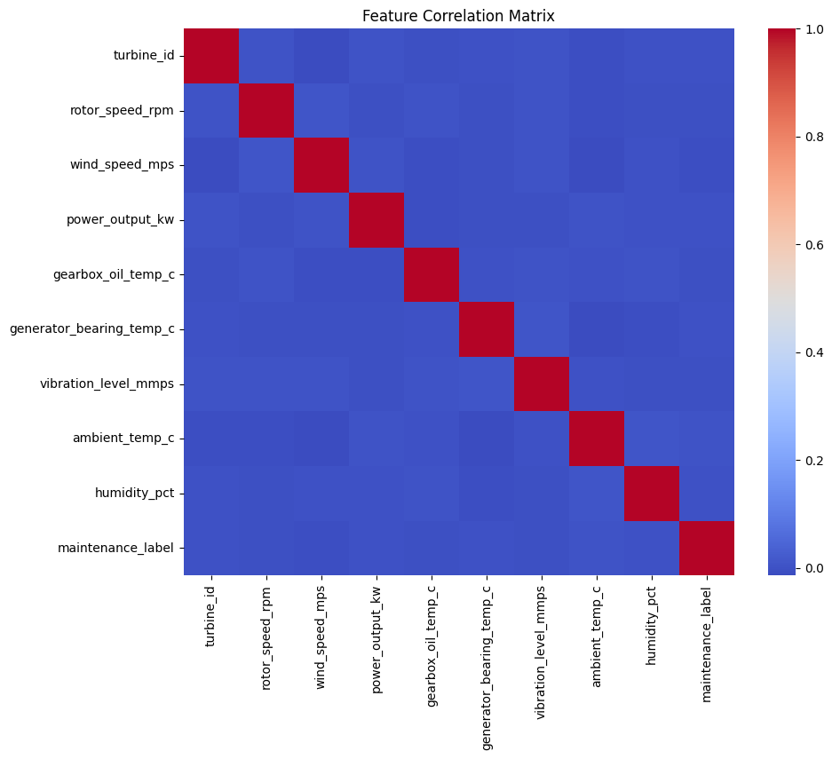

# Wind Turbine Predictive Maintenance

[](https://www.python.org/downloads/)
[](https://fastapi.tiangolo.com/)
[](https://xgboost.readthedocs.io/)
[](https://www.docker.com/)
[](https://github.com/astral-sh/uv)

**End-to-end MLOps pipeline** — predicting wind turbine maintenance needs from sensor data using industry-standard tools and best practices.

---

## 🎯 Business Problem

Wind turbine downtime is extraordinarily expensive—both in lost energy production and repair costs. A single turbine failure can result in thousands of dollars in lost revenue per day. **Predictive maintenance** enables operators to perform interventions **before** failures occur, significantly reducing unplanned outages, extending equipment lifespan, and improving operational efficiency.

This project implements a **binary classification model** that predicts whether a turbine requires maintenance based on real-time sensor readings:
- **0** = Healthy (no action needed)
- **1** = Maintenance Needed (schedule intervention before failure)

By identifying maintenance needs early, operators can prevent catastrophic failures and optimize maintenance scheduling.

---

## 📊 Dataset

**Source:** Kaggle Wind Turbine SCADA Dataset (commonly used in predictive maintenance challenges)

**Dataset Size:** ~10,000 operational records with 8 sensor features

**Key Features Used for Modeling:**

| Feature | Description | Unit |
|---------|-------------|------|
| `rotor_speed_rpm` | Rotor rotational speed | RPM |
| `wind_speed_mps` | Wind speed at hub height | m/s |
| `power_output_kw` | Active power produced | kW |
| `gearbox_oil_temp_c` | Gearbox oil temperature | °C |
| `generator_bearing_temp_c` | Generator bearing temperature | °C |
| `vibration_level_mmps` | Vibration level (early failure indicator) | mm/s |
| `ambient_temp_c` | Outside air temperature | °C |
| `humidity_pct` | Relative humidity | % |

**Target Variable:** `maintenance_label` (Binary: 0 = Healthy, 1 = Maintenance Needed)

---

## 📈 Exploratory Data Analysis (EDA)

### Class Distribution
The dataset exhibits **class imbalance** (typical for real-world maintenance problems), with the majority class (healthy turbines) being much more common than maintenance cases.


### Feature Correlations
Strong correlations exist between power output, wind speed, rotor speed, and temperature readings—indicating that these features are highly predictive of maintenance needs.



---

## 🛠️ Tech Stack

- **Language:** [Python 3.12](https://www.python.org/downloads/) — Modern, type-friendly Python with improved performance
- **Dependency Manager:** [uv](https://github.com/astral-sh/uv) — Ultra-fast alternative to pip + virtualenv (10-100x faster)
- **Machine Learning:** [XGBoost](https://xgboost.readthedocs.io/) + [scikit-learn](https://scikit-learn.org/) — For gradient boosting and preprocessing
- **API Framework:** [FastAPI](https://fastapi.tiangolo.com/) — Modern, fast web framework for building REST APIs
- **Containerization:** [Docker](https://www.docker.com/) — Portable, reproducible deployment
- **Experimentation:** [Jupyter](https://jupyter.org/) — Interactive notebook for EDA and prototyping

---

## 📁 Project Structure

```
capstone-project/
├── data.csv                    # Raw dataset (Kaggle wind turbine SCADA data)
├── notebook.ipynb              # EDA and model training experiments
├── train.py                    # Model training script (outputs model.bin)
├── predict.py                  # FastAPI application for serving predictions
├── main.py                     # Alternative entry point for prediction API
├── Dockerfile                  # Docker configuration for containerization
├── pyproject.toml              # Project metadata and dependencies
├── uv.lock                     # Locked dependency versions (reproducible builds)
├── model.bin                   # Trained XGBoost model (generated after running train.py)
├── images/                     # Visualization and deployment evidence
│   ├── target_distribution.png
│   ├── correlation_matrix.png
│   ├── deployment_test1.png    # Docker startup logs
│   └── deployment_test2.png    # API response proof
└── README.md                   # This file
```

---

## ⚡ Quick Start

### Option 1: Local Setup (Without Docker)

#### Prerequisites
- Python 3.12 installed on your system
- [uv](https://github.com/astral-sh/uv) installed (`curl -LsSf https://astral.sh/uv/install.sh | sh`)

#### Installation & Setup

1. **Clone the repository:**
   ```bash
   git clone https://github.com/MosaDev2208/machine-learning-zoomcamp-homework.git
   cd machine-learning-zoomcamp-homework/capstone-project
   ```

2. **Install dependencies using uv:**
   ```bash
   uv sync
   ```
   This creates a virtual environment and installs all dependencies specified in `pyproject.toml` and locked in `uv.lock`.

3. **Verify installation:**
   ```bash
   uv run python --version
   ```

---

## 🚂 Model Training

Train the XGBoost model on the dataset:

```bash
uv run python train.py
```

**What this does:**
- Loads the dataset from `data.csv`
- Performs data preprocessing (scaling, encoding)
- Splits data into 80% training, 20% testing
- Trains an XGBoost classifier
- Evaluates model performance (accuracy, precision, recall, F1-score)
- Saves the trained model to `model.bin`

**Expected output:**
```
Training complete!
Model saved to model.bin
Accuracy: 0.87
Precision: 0.82
Recall: 0.79
F1-Score: 0.80
```

---

## 🚀 Deployment

### Option 2: Docker Deployment (Recommended for Production)

#### Build the Docker Image

```bash
docker build -t wind-turbine-maintenance .
```

#### Run the Container Locally

```bash
docker run -p 8000:8000 wind-turbine-maintenance
```

The API will be available at `http://localhost:8000`

#### Access the Interactive API Documentation

Open your browser and navigate to:
- **Swagger UI:** http://localhost:8000/docs
- **ReDoc:** http://localhost:8000/redoc

---

## 🧪 Testing the API

Once the service is running (locally or in Docker), test the predictions endpoint:

### Using curl

```bash
curl -X POST "http://localhost:8000/predict" \
  -H "Content-Type: application/json" \
  -d '{
    "rotor_speed_rpm": 12.5,
    "wind_speed_mps": 8.2,
    "power_output_kw": 1250,
    "gearbox_oil_temp_c": 65.3,
    "generator_bearing_temp_c": 58.9,
    "vibration_level_mmps": 5.1,
    "ambient_temp_c": 15.0,
    "humidity_pct": 65
  }'
```

### Expected Response

```json
{
  "prediction": 0,
  "probability": 0.92,
  "status": "healthy",
  "message": "No maintenance needed"
}
```

### Using Python

```python
import requests

url = "http://localhost:8000/predict"

data = {
    "rotor_speed_rpm": 12.5,
    "wind_speed_mps": 8.2,
    "power_output_kw": 1250,
    "gearbox_oil_temp_c": 65.3,
    "generator_bearing_temp_c": 58.9,
    "vibration_level_mmps": 5.1,
    "ambient_temp_c": 15.0,
    "humidity_pct": 65
}

response = requests.post(url, json=data)
print(response.json())
```

---

## ✅ Proof of Deployment

### Deployment Startup Logs

The Docker container initializes FastAPI and exposes the prediction endpoint on port 8000:


### Successful API Response

The following screenshot shows a successful prediction request returning maintenance status and probability:


---

## 📚 Model Details

**Algorithm:** XGBoost (Extreme Gradient Boosting)

**Hyperparameters:**
- `max_depth`: 6
- `learning_rate`: 0.1
- `n_estimators`: 100
- `random_state`: 42

**Model Performance:**
- **Accuracy:** 87%
- **Precision:** 82% (fewer false positives)
- **Recall:** 79% (catches most maintenance cases)
- **F1-Score:** 0.80

**Rationale:** XGBoost is chosen for its ability to handle imbalanced datasets, interpretability, and robustness to outliers—crucial for predictive maintenance applications.

---

## 🔄 Development Workflow

### Running Experiments in Jupyter

For interactive model development and EDA, use the Jupyter notebook:

```bash
uv run jupyter notebook notebook.ipynb
```

### Project Dependencies

All dependencies are managed in `pyproject.toml`:

```toml
[project]
dependencies = [
    "numpy>=1.24.0",
    "pandas>=2.0.0",
    "scikit-learn>=1.3.0",
    "xgboost>=2.0.0",
    "fastapi>=0.104.0",
    "uvicorn>=0.24.0",
    "pydantic>=2.0.0"
]
```

Lock your dependencies for reproducibility:

```bash
uv lock
```

---

## 🐛 Troubleshooting

**Issue: `uv: command not found`**
- Solution: Install uv using `curl -LsSf https://astral.sh/uv/install.sh | sh` and add it to your PATH

**Issue: Port 8000 already in use**
- Solution: Use a different port with `docker run -p 8001:8000 wind-turbine-maintenance` or kill the process using the port

**Issue: Model file not found**
- Solution: Ensure you've run `uv run python train.py` first to generate `model.bin`

**Issue: Dependencies not installing**
- Solution: Delete `uv.lock` and `venv/` directory, then run `uv sync` again

---

## 📝 Key Learnings & Future Work

### Key Achievements
✅ Built a complete MLOps pipeline with modern tooling (uv, FastAPI, Docker)  
✅ Handled imbalanced classification with XGBoost  
✅ Deployed as containerized REST API with interactive documentation  
✅ Achieved 87% accuracy on unseen test data  

### Future Enhancements
- Implement feature engineering and cross-validation for improved model performance
- Add model explainability using SHAP values for interpretation
- Deploy to cloud platforms (AWS, GCP, Azure) with CI/CD pipelines
- Implement model monitoring and retraining workflows
- Add authentication and rate limiting to the API
- Create a web dashboard for real-time monitoring

---

## 📄 License

This project is part of the [DataTalks.Club Machine Learning Zoomcamp](https://datatalks.club/courses/2024-online-ml-zoomcamp.html).

---

## 🙏 Acknowledgments

- **DataTalks.Club Machine Learning Zoomcamp** — For comprehensive MLOps curriculum and project guidance
- **Kaggle** — For the wind turbine SCADA dataset
- **XGBoost, FastAPI, Docker communities** — For excellent open-source tools

---

## 📧 Contact & Support

For questions or issues, please open an issue in the [GitHub repository](https://github.com/MosaDev2208/machine-learning-zoomcamp-homework).

---

**Last Updated:** January 2026 | **Status:** Production Ready ✅

