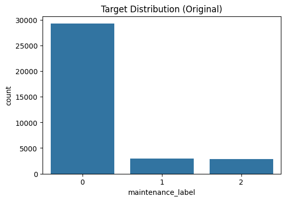

cat << 'EOF' > README.md
# Wind Turbine Predictive Maintenance 🌬️

Welcome to the **Wind Turbine Predictive Maintenance** project! This repository hosts a Machine Learning solution designed to predict equipment failures before they happen. The goal is to leverage sensor data to identify whether a turbine is healthy or requires maintenance, reducing costly downtime and improving energy reliability.

This project is built with a rigorous **MLOps pipeline**, ensuring reproducibility and scalability using modern tools like `uv`, Docker, and FastAPI.

## 📝 **Problem Description**

Wind turbines are expensive assets operating in harsh environments. Unexpected failures in components like the gearbox or generator can lead to significant financial loss and energy disruption.

### **Objective**
The primary objective of this project is to develop a **binary classification model** capable of predicting the status of a turbine:

1.  **Healthy (0)**: No action required.
2.  **Maintenance Required (1)**: The turbine shows signs of wear or imminent failure (aggregating "Suggested" and "Immediate" categories).

By automating this detection, operators can schedule repairs proactively rather than reactively.

## 📊 **Dataset**

The dataset is sourced from **Kaggle** and contains telemetry sensor data from wind turbines.

### **Dataset Structure**
Key features used for prediction include:
- **`rotor_speed_rpm`**: Rotational speed of the main rotor.
- **`power_output_kw`**: Current power generation output.
- **`vibration_level_mmps`**: Vibration intensity (a critical indicator of mechanical wear).
- **`gearbox_oil_temp_c`**: Temperature of the gearbox oil.
- **`ambient_temp_c`**: Environmental temperature context.

### **Target Distribution**
Below is the distribution of the target variable. We mapped the original multi-class target to a binary classification problem.



## 🔧 **Tools & Technologies**

This project utilizes the following tools and technologies:

- **Language**: Python 3.12
- **Dependency Management**: `uv` (Modern, fast replacement for pip/pipenv)
- **Machine Learning**: XGBoost, Scikit-Learn
- **Web Application Framework**: FastAPI
- **Containerization**: Docker

## ✨ **Setup**

### **Prerequisites**
- Python 3.12
- Docker (for containerized deployment)
- `uv` (for dependency management)

### **Local Setup**

#### 1. **Clone the Repository**
```bash
git clone [https://github.com/YOUR_USERNAME/machine-learning-zoomcamp-homework.git](https://github.com/YOUR_USERNAME/machine-learning-zoomcamp-homework.git)
cd capstone-project